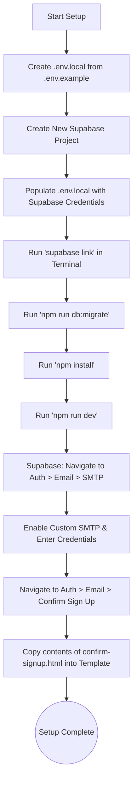

# Project Setup & Handover Instructions

## 1. Environment Setup
Create a new `.env.local` file by copying `.env.example`.

## 2. Supabase Project Initialization
Create a new Project in Supabase and populate the `.env.local` file with your credentials:
- **NEXT_PUBLIC_SUPABASE_URL**: `https://kvpotatpvwauunwhbyir.supabase.co`
- **NEXT_PUBLIC_SUPABASE_ANON_KEY**: `sb_publishable_6ToGpA4txRCvytDeqpEwSQ_NtPIV5Uw`
- **SUPABASE_SERVICE_ROLE_KEY**: *(Copy from Supabase Secret Key)*
- **SUPABASE_PROJECT_ID**: *(Your Project ID)*
- **DATABASE_URL**: *(Your Database URL)*

Save the `.env.local` file.

## 3. Link and Migrate Database
- In your terminal, run `supabase link` and select the corresponding Supabase project.
- Run `npm run db:migrate` to deploy the local `supabase/migration` scripts to the live Supabase database.

## 4. Install and Run Application
- Run `npm install` to install project dependencies.
- Run `npm run dev` to start the local development server.

## 5. Supabase Authentication & SMTP Setup
To enable authentication and email delivery:
1. In the Supabase Dashboard, go to **Authentication** > **Email** > **SMTP Settings**.
2. Enable **Custom SMTP**.
3. Fill in the following credentials:
   - **Sender email address**: *(your email)*
   - **Sender name**: Evetdoc
   - **Host**: `smtp.gmail.com`
   - **Port**: `465`

## 6. Setup Email Templates
To customize the welcome and confirmation emails:
1. In the Supabase Dashboard, navigate to **Authentication** > **Email** > **Confirm Sign Up**.
2. From this repository, open the file `docs/supabase/email-template/confirm-signup.html`.
3. Copy the contents of the HTML file and paste it into the **Confirm Sign Up** email template field in Supabase.

---

## Setup Flow Diagram

